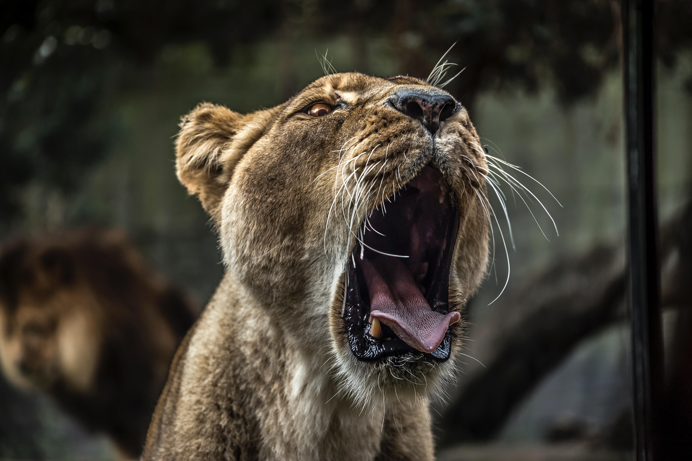

<html lang="fr">

<head>
    <meta charset="utf-8">
    <meta http-equiv="X-UA-Compatible" content="IE=edge">
    <meta name="viewport" content="width=device-width, initial-scale=1">
    <title>Wild Campus Tours</title>
    <link rel="icon" type="image/png" href="favicon.png">
    <link rel="stylesheet" href="https://maxcdn.bootstrapcdn.com/font-awesome/4.7.0/css/font-awesome.min.css">
    <link rel="stylesheet" href="https://unpkg.com/bulma@0.7.5/css/bulma.min.css" />
    <link rel="stylesheet" href="https://maxcdn.bootstrapcdn.com/bootstrap/4.0.0/css/bootstrap.min.css" integrity="sha384-Gn5384xqQ1aoWXA+058RXPxPg6fy4IWvTNh0E263XmFcJlSAwiGgFAW/dAiS6JXm" crossorigin="anonymous">
    <link rel="stylesheet" type="text/css" href="style2.css">
    <link rel="stylesheet" type="text/css" href="bootstrap.min.css">
</head>
<!--<a href="https://icons8.com/icon/42201/en-cours">En cours icon by Icons8</a>-->

<body>
    <header>

        <nav class="navbar navbar-expand-lg bg-white">
            

                
            

            <button class="navbar-toggler" type="button" data-toggle="collapse" data-target="#navbarColor01" aria-controls="navbarColor01" aria-expanded="false" aria-label="Toggle navigation">
                
                    
                
            </button>

            

                <ul class="navbar-nav mr-auto">
                    <li class="nav-item active">
                        <a class="nav-link" href="index.html">Accueil (current)</a>
                    </li>
                    <li class="nav-item">
                        <a class="nav-link" href="formation.html">Formation</a>
                    </li>
                    <li class="nav-item">
                        <a class="nav-link" href="outils.html">Outils</a>
                    </li>
                    <li class="nav-item">
                        <a class="nav-link" href="contact.html">Contact</a>
                    </li>
                </ul>
                <form class="form-inline my-2 my-lg-0" data-children-count="1">
                    <input class="form-control mr-sm-2" type="text" placeholder="Rechercher">
                    <button class="btn btn-secondary my-2 my-sm-0" type="submit">Go</button>
                </form>
            

        </nav>

    </header>

    <!-- introduction -->

    <section class="container-fluid intro">
        

            <h1>La vie sur le Campus de Tours</h1>
            <h2>Intégration d'un Wilder</h2>
        

    </section>

    <!-- Présentation de la MAME -->

    <section class="container-fluid prez">

        

            

                
            

        

        

            <h2 class="mt-4">Un Campus au sein de la French Tech Loire Valley</h2>
        

    </section>
    
    <!-- Presentation de la wcs -->

    <section>

        

           

          
                
                
Une formation au coeur d'un écosystème numérique

           
            

  
            

                
                
Un fort taux d'insertion professionnelle (90%)

            

            

                
                
Une formation en présentiel de 5 mois + 2 à 3 mois en entreprise

            

        

        

    </section>

    <!-- slider -->
    <h2 class="my-5">Bienvenue à la Wild Code School</h2>

    

        <ol class="carousel-indicators">
          <li data-target="#carouselExampleIndicators" data-slide-to="0" ></li>
          <li data-target="#carouselExampleIndicators" data-slide-to="1"></li>
          <li data-target="#carouselExampleIndicators" data-slide-to="2"></li>
        </ol>
        

          

             
            
           

                
 Wild

           

          

          

                
            
            

                    
 Code

               

          

          

                
            
            

                    
 School

               

          

        

        <a class="carousel-control-prev" href="#carouselExampleIndicators" role="button" data-slide="prev">
          
          Previous
        </a>
        <a class="carousel-control-next" href="#carouselExampleIndicators" role="button" data-slide="next">
          
          Next
        </a>
      

 <!-- Témoignages de wilders -->
   

       <h3 id="texttestimonials mt-5">Témoignage de Wilders</h3>
       

           

               
               
La première semaine,  je n'ai pas dormi, je ne suis pas sorti, je n'ai pas mangé. Je suis un vrai zombie, mais j'aime ça !

           

           

               
               
Je pense qu’ici personne ne vient à reculons. Je suis ravi d’avoir intégré la WCS, une ecole innovante !

           

       

       

           

               
               
Passer de l’élevage de penguin à la Wild Code School c’est intense mais ça en vaut la peine.

           

            

               
               
La WCS le plaisir d’apprendre à coder

           

       

   

    <footer class="navbar-footer">

        <a href="index.html">Accueil</a>
        <a href="formation.html">Formation</a>
        <a href="outils.html">Outils</a>
        <a href="contact.html">Contact</a>
        <a href="mentions.html">Mentions légales</a>
    </footer>
    
    
    
</body>

</html>
